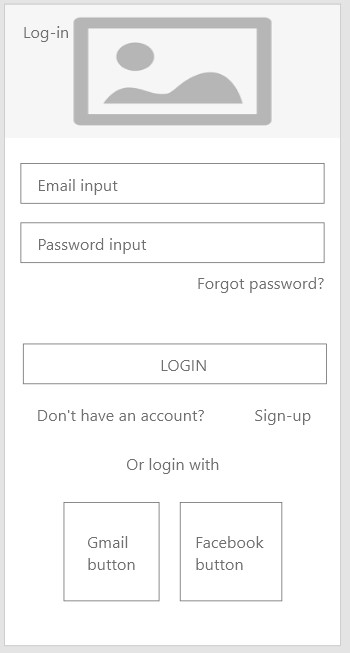

# Layouts: Leccion 1

Tomando el siguiente mockup como referencia:

Construir una pantalla de Login haciendo uso de Jetpack Compose.

IMPORTANTE:

- El texto "Log in" debe estar por encima de la imagen.
- `*Forgot password*` y `*Sign up*` deben ser botones sin "fondo" (existe un composable con dicha característica).
- `Gmail button` y `Facebook button` deben ser botones con imagen (ídem punto anterior).

BONUS TRACK:

- Agregar al campo de contraseña un toggle de visibilidad.
- Al presionar el botón de Login, limpiar los campos de Email y Contraseña.